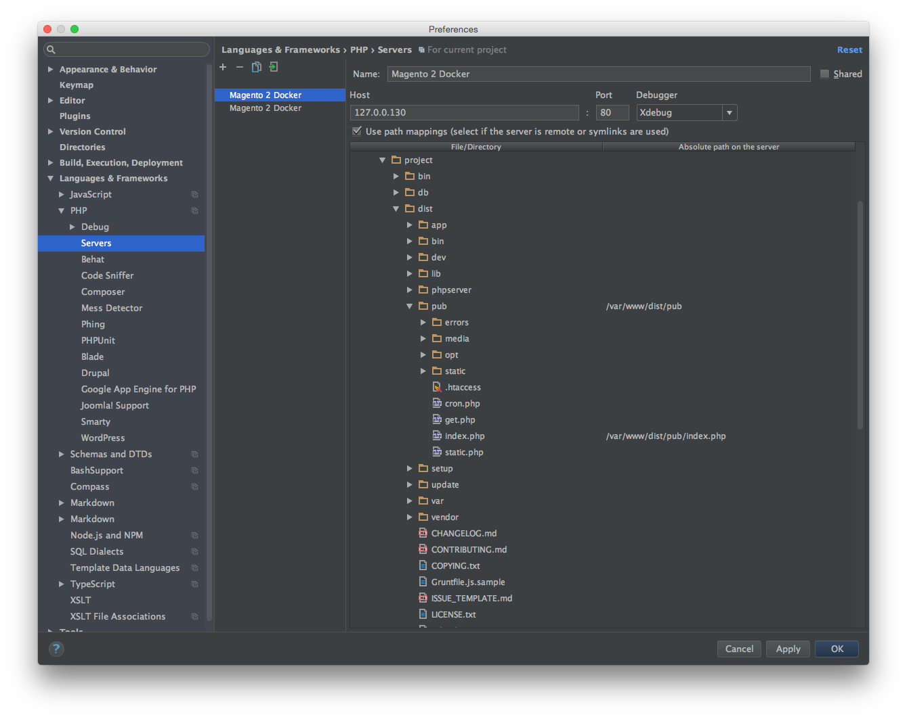

# dnmp
All in one webstack docker image.

## Services
- java
- elasticsearch
- mysql
- nginx
- nodejs
- php
- postfix
- redis
- varnish (port: 81)

## PHP xdebug 
php xdebug is disabled by default. You can use the following environment variables to setup xdebug.

- **XDEBUG_ENABLE** (true|false)
- **XDEBUG_REMOTE_AUTOSTART** (true|false)
- **XDEBUG_REMOTE_HOST**
- **XDEBUG_REMOTE_PORT** (php default: 9000)

### General usage with a new container
`docker run -e XDEBUG_ENABLE=true -e XDEBUG_REMOTE_AUTOSTART=true -e XDEBUG_REMOTE_HOST=192.168.2.2 techdivision/dnmp`   

- Enable xdebug: `docker exec -it <name> setup-xdebug -r -e -a -h=<ip-address> -p=9000`
- Disable xdebug: `docker exec -it <name> setup-xdebug -r -d`
- To see all parameters run `docker exec -it <name> setup-xdebug --help`

### Setting up with PHPStorm

- Find out ip address of local machine: `ifconfig|grep inet|grep 10|head -1`
- Insert container name as well as ip address: `docker exec -it <name> setup-xdebug -r -e -a -h=<ip-address> -p=9000`
- Set up PHPStorm like the following and be sure to use the correct server name `Magento 2 Docker` (you can use whatevery server name you want, but remember it, we need it in the next step)

- `docker exec -ti <name> sh`
- Fill in the server name here from the step above: `'env[PHP_IDE_CONFIG]="serverName=Magento 2 Docker"' >> /etc/php7/php-fpm.conf`
- Save the file and run `supervisorctl restart php7-fpm`
